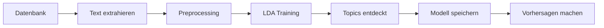

# Gruppe P1-3 — Projekt

## 📋 Inhaltsverzeichnis

- [Requirements / Dependencies](#-requirements--dependencies)
- [Schnellstart](#-schnellstart)
- [Einrichtung](#-einrichtung)
- [Projektstruktur](#-projektstruktur)
- [LDA Topic Modeling](#-lda-topic-modeling)
- [Technologie-Stack](#️-technologie-stack)

## ⚡ Schnellstart

```bash
# Backend starten
cd backend
uv sync
uv run uvicorn main:app --reload

# Frontend starten (neues Terminal)
cd frontend
npm install
npm run dev
```

**Backend:** `http://localhost:8000` | **API Docs:** `http://localhost:8000/docs`  
**Frontend:** `http://localhost:5173`

## 📋 Requirements / Dependencies

Um das Projekt lokal laufen zu lassen, benötigst du:

* **Python** >= 3.13
* **Node.js** v20
* **uv** → https://docs.astral.sh/uv/
* **Supabase Account** (für Datenbank)
* IDE deiner Wahl, bevorzugt **VSCode**

## 🚀 Einrichtung

### Backend (FastAPI)

Wenn `uv` installiert ist, öffne das Terminal und führe folgendes aus:

```bash
cd backend
uv sync
```

Anschließend wählst du den `.venv`-Ordner als Python Interpreter für das Projekt aus.

**Alternative ohne uv:** Falls du klassisches `pip` verwenden möchtest:

```bash
cd backend
python -m venv .venv
source .venv/bin/activate  # Auf macOS/Linux
# .venv\Scripts\activate  # Auf Windows
pip install -r requirements.txt
```

Der Backend-Server kann wie folgt gestartet werden:

```bash
uv run uvicorn main:app --reload
```

oder mit klassischem Python:

```bash
python -m uvicorn main:app --reload
```

**Backend läuft unter:** `http://localhost:8000`  
**API-Dokumentation:** `http://localhost:8000/docs` (Swagger UI)

### Frontend (React + Vite)

Wenn `node` installiert ist, öffne das Terminal und führe folgendes aus:

```bash
cd frontend
npm install
```

Anschließend kannst du den Frontend-Dev-Server wie folgt starten:

```bash
npm run dev
```

**Frontend läuft unter:** `http://localhost:5173`

## � Umgebungsvariablen

Erstelle eine `.env`-Datei im `backend/` Ordner:

```env
# Supabase Configuration
SUPABASE_URL=deine-supabase-url
SUPABASE_KEY=dein-supabase-key

# Optional: API Configuration
API_HOST=0.0.0.0
API_PORT=8000
```

**Wichtig:** Die `.env`-Datei ist in `.gitignore` und wird nicht ins Repository committed!

## �💡 Tipps

* Am besten hast du **2 Terminal-Sessions** offen, um Backend und Frontend gleichzeitig zu nutzen!
* Stelle sicher, dass die `.env`-Datei im Backend-Ordner korrekt konfiguriert ist
* Für Production-Build des Frontends: `npm run build`
* Cache löschen: `find . -type d -name "__pycache__" -exec rm -rf {} +`
* Alte Modelle löschen: `cd backend/models && rm -f lda_model_*.* 2>/dev/null`

## 📁 Projektstruktur

```
gruppe-P1-3/
├── backend/                      # FastAPI Backend
│   ├── main.py                  # Haupteinstiegspunkt
│   ├── config.py                # Konfiguration
│   ├── pyproject.toml           # Python Dependencies (uv)
│   ├── requirements.txt         # Python Dependencies (pip)
│   ├── database/                # Datenbankverbindungen (Supabase)
│   │   └── supabase_client.py
│   ├── migrations/              # SQL-Migrationen
│   │   ├── 001_create_candidates_table.sql
│   │   ├── 002_create_employee_table.sql
│   │   ├── 003_create_companies_table.sql
│   │   └── 004_add_company_references.sql
│   ├── models/                  # Machine Learning Modelle
│   │   ├── lda_topic_model.py  # LDA Topic Modeling
│   │   └── sentiment_analyzer.py # Sentiment-Analyse
│   ├── services/                # Business Logic Services
│   │   ├── excel_service.py    # Excel Import/Export
│   │   ├── topic_model_service.py # Topic Modeling DB Service
│   │   └── topic_rating_service.py # Topic-Rating-Analyse
│   ├── routes/                  # API Endpoints
│   │   ├── companies.py
│   │   ├── topics.py           # Topic Modeling API
│   │   └── upload.py
│   ├── docs/                    # Dokumentation
│   │   ├── TOPIC_MODELING_API.md
│   │   └── TOPIC_RATING_ANALYSIS.md
│   └── examples/                # Beispiele & Demos
│       ├── topic_modeling_examples.py
│       └── topic_rating_examples.py
├── frontend/                    # React/Vite Frontend
│   ├── src/                    # Quellcode
│   │   ├── components/         # React Komponenten
│   │   │   ├── dashboard/     # Dashboard Components
│   │   │   │   ├── CategoryRatingCard.jsx
│   │   │   │   ├── DominantTopicsCard.jsx
│   │   │   │   ├── IndividualReviewsCard.jsx
│   │   │   │   ├── TimelineCard.jsx
│   │   │   │   ├── TopicOverviewCard.jsx  # Topic Übersicht (NEU)
│   │   │   │   └── modals/
│   │   │   │       ├── MostCriticalModal.jsx
│   │   │   │       ├── NegativTopicModal.jsx
│   │   │   │       ├── SorceModal.jsx
│   │   │   │       ├── TrendModal.jsx
│   │   │   │       ├── TopicTableModal.jsx    # Topic Tabelle (NEU)
│   │   │   │       └── TopicDetailModal.jsx   # Topic Details (NEU)
│   │   │   └── ui/            # UI Components (shadcn)
│   │   ├── pages/             # Seiten
│   │   │   ├── Dashboard.jsx
│   │   │   └── Welcome.jsx
│   │   └── lib/               # Utilities
│   ├── public/                # Statische Assets
│   └── package.json           # Node.js Dependencies
└── requirements.txt            # Python Dependencies (Projekt-Root)
```

## 🛠️ Technologie-Stack

### Backend
* **Framework:** FastAPI (moderne Python Web API)
* **Server:** Uvicorn (ASGI Server)
* **Datenbank:** Supabase (PostgreSQL)
* **ML/AI:** 
  - Gensim 4.3+ (LDA Topic Modeling)
  - Custom Sentiment-Analyse (Lexikon-basiert)
* **Datenverarbeitung:** Pandas, OpenPyXL
* **Tools:** Python-dotenv, Python-multipart

### Frontend
* **Framework:** React 19
* **Build Tool:** Vite 5
* **Routing:** React Router DOM
* **UI Library:** shadcn/ui (Radix UI + Tailwind CSS)
* **Charts:** Recharts (Line Charts, Gauge Charts)
* **Icons:** Lucide React
* **Linting:** ESLint

### Dashboard Features
* **Topic Übersicht (NEU):**
  - Interaktive Topic-Tabelle mit Suchfunktion
  - Detailansicht mit Line Chart (Rating über Zeit)
  - Gauge Chart für Sentiment-Visualisierung
  - Typische Aussagen und Beispiel-Reviews
  - Zweistufige Modal-Interaktion (Tabelle → Details)
  - Verwendet aktuell Dummy-Daten zur Demonstration

### Datenbank Schema
* **Tables:** `candidates`, `employee`, `companies`
* **Features:** Star ratings, text feedback, relational data

## 🤖 LDA Topic Modeling

Dieses Projekt enthält eine vollständige **LDA Topic Modeling**-Integration mit **Gensim** zur automatischen Themenextraktion aus Kandidaten- und Mitarbeiter-Feedback.

### Features

✅ **Automatische Topic-Erkennung** in Textdaten  
✅ **Sentiment-Analyse** - Erkennt positive, neutrale und negative Bewertungen  
✅ **Sterne-Bewertungen** - Kombiniert Text-Topics mit Rating-Daten  
✅ **Datenbankintegration** - Direkter Zugriff auf Kandidaten- und Mitarbeiter-Daten  
✅ **RESTful API** - 12 Endpunkte für Training, Analyse und Vorhersage  
✅ **Modellpersistenz** - Speichern und Laden trainierter Modelle  
✅ **Deutsche Textverarbeitung** - Optimierte Stopword-Liste  
✅ **Flexible Analyse** - Einzelne Texte oder ganze Datensätze  
✅ **Topic-Rating-Korrelation** - Verstehe welche Themen wie bewertet werden  

### Schnellstart

1. **Backend starten:**
   ```bash
   cd backend
   uv run uvicorn main:app --reload
   ```

2. **API-Dokumentation öffnen:**
   ```
   http://localhost:8000/docs
   ```

3. **Erstes Modell trainieren:**
   ```bash
   curl -X POST http://localhost:8000/api/topics/train \
     -H "Content-Type: application/json" \
     -d '{"source": "both", "num_topics": 5}'
   ```

### API-Endpunkte

| Endpoint | Methode | Beschreibung |
|----------|---------|--------------|
| `/api/topics/status` | GET | Model-Status abrufen |
| `/api/topics/database/stats` | GET | Datenbank-Statistiken |
| `/api/topics/train` | POST | Neues Modell trainieren |
| `/api/topics/topics` | GET | Entdeckte Topics anzeigen |
| `/api/topics/predict` | POST | Topics für Text vorhersagen |
| `/api/topics/predict-with-sentiment` | POST | Topics + Sentiment-Analyse |
| `/api/topics/analyze-record` | POST | Spezifischen Datensatz analysieren |
| `/api/topics/analyze/employee-reviews-with-ratings` | GET | Employee Reviews mit Topics, Sentiment & Ratings |
| `/api/topics/analyze/candidate-reviews-with-ratings` | GET | Candidate Reviews mit Topics, Sentiment & Ratings |
| `/api/topics/analyze/topic-rating-correlation` | GET | Korrelation zwischen Topics und Bewertungen |
| `/api/topics/models/list` | GET | Gespeicherte Modelle auflisten |
| `/api/topics/models/load` | POST | Gespeichertes Modell laden |

### Installation testen

```bash
cd backend
uv run python test_topic_modeling.py
```

### Beispiele ausführen

**Basic Topic Modeling:**
```bash
cd backend
uv run python examples/topic_modeling_examples.py
```

**Topic-Rating-Analyse (NEU):**
```bash
cd backend
uv run python examples/topic_rating_examples.py
```

### Dokumentation

- 📖 **Schnellstart**: [`backend/QUICKSTART_TOPIC_MODELING.md`](backend/QUICKSTART_TOPIC_MODELING.md)
- 📚 **API-Referenz**: [`backend/docs/TOPIC_MODELING_API.md`](backend/docs/TOPIC_MODELING_API.md)
- 🎯 **Feature-Guide**: [`backend/TOPIC_MODELING_README.md`](backend/TOPIC_MODELING_README.md)
- ⭐ **Topic-Rating-Analyse (NEU)**: [`backend/docs/TOPIC_RATING_ANALYSIS.md`](backend/docs/TOPIC_RATING_ANALYSIS.md)
- 💡 **Beispiele**: [`backend/examples/`](backend/examples/)
  - `topic_modeling_examples.py` - Basic LDA
  - `topic_rating_examples.py` - Topics + Sentiment + Ratings

### Projektstruktur (Topic Modeling)

```
backend/
├── models/
│   ├── lda_topic_model.py          # LDA-Modell-Implementierung (mit Sentiment)
│   └── sentiment_analyzer.py       # Sentiment-Analyse für deutsche Texte (NEU)
├── services/
│   ├── topic_model_service.py      # Datenbankservice
│   └── topic_rating_service.py     # Topic-Rating-Analyse (NEU)
├── routes/
│   └── topics.py                   # API-Endpunkte (erweitert)
├── examples/
│   ├── topic_modeling_examples.py  # Basic LDA Beispiele
│   └── topic_rating_examples.py    # Topic-Rating Beispiele (NEU)
├── docs/
│   ├── TOPIC_MODELING_API.md       # Vollständige API-Doku
│   └── TOPIC_RATING_ANALYSIS.md    # Topic-Rating Feature-Doku (NEU)
├── test_topic_modeling.py          # Installationstest
├── TOPIC_MODELING_README.md        # Feature-Dokumentation
└── QUICKSTART_TOPIC_MODELING.md    # Schnellstart-Anleitung
```

### Workflow



### Datenquellen

**Candidates-Tabelle:**
- `stellenbeschreibung`
- `verbesserungsvorschlaege`

**Employee-Tabelle:**
- `jobbeschreibung`
- `gut_am_arbeitgeber_finde_ich`
- `schlecht_am_arbeitgeber_finde_ich`
- `verbesserungsvorschlaege`

### Beispiel-Verwendung

#### Python (Topic-Rating-Analyse):
```python
import requests

# Modell trainieren
response = requests.post(
    "http://localhost:8000/api/topics/train",
    json={"source": "employee", "num_topics": 5}
)
print(response.json())

# Employee Reviews mit Sentiment & Ratings analysieren
response = requests.get(
    "http://localhost:8000/api/topics/analyze/employee-reviews-with-ratings",
    params={"limit": 50}
)
analysis = response.json()['analysis']

# Topic-Rating-Korrelation abrufen
response = requests.get(
    "http://localhost:8000/api/topics/analyze/topic-rating-correlation"
)
correlation = response.json()['correlation']

for topic in correlation['topics']:
    print(f"Topic {topic['topic_id']}: "
          f"{topic['avg_rating']:.1f}⭐ "
          f"({topic['mention_count']} Erwähnungen)")
```

#### cURL:
```bash
# Topics mit Ratings analysieren
curl "http://localhost:8000/api/topics/analyze/topic-rating-correlation"

# Text mit Sentiment analysieren
curl -X POST http://localhost:8000/api/topics/predict-with-sentiment \
  -H "Content-Type: application/json" \
  -d '{"text": "Die Work-Life-Balance ist ausgezeichnet!", "threshold": 0.1}'
```

### Technische Details

- **LDA-Algorithmus**: Latent Dirichlet Allocation mit Gensim
- **Sentiment-Analyse**: Lexikon-basiert mit 100+ deutschen Sentiment-Wörtern
  - Erkennt Intensifizierer (sehr, extrem, total)
  - Berücksichtigt Negationen (nicht, kein, nie)
  - Berechnet Polarity (-1 bis +1) und Subjectivity (0 bis 1)
- **Preprocessing**: Lowercase, Stopword-Entfernung, Token-Filterung
- **Sprache**: Optimiert für deutsche Texte
- **Parameter**: Konfigurierbare Topics (2-20), Passes, Iterations
- **Speicherung**: Automatisches Speichern trainierter Modelle
- **Integration**: Kombiniert Topics, Sentiment und Sterne-Bewertungen

## 🚨 Häufige Probleme & Lösungen

### Backend startet nicht
```bash
# Port 8000 ist belegt
lsof -ti:8000 | xargs kill -9
uv run uvicorn main:app --reload
```

### Frontend startet nicht
```bash
# Dependencies fehlen
cd frontend
npm install
npm run dev
```

### "Model not trained" Error
```bash
# Trainiere zuerst ein Modell
curl -X POST http://localhost:8000/api/topics/train \
  -H "Content-Type: application/json" \
  -d '{"source": "employee", "num_topics": 5}'
```

### Python Cache Probleme
```bash
# Lösche alle __pycache__ Verzeichnisse
find . -type d -name "__pycache__" -exec rm -rf {} +
```

### Alte Modelle löschen
```bash
# Speicherplatz freigeben
cd backend/models
rm -f lda_model_*.* 2>/dev/null
```

## 📚 Weitere Ressourcen

- **API Dokumentation**: http://localhost:8000/docs (Swagger UI)
- **Supabase**: https://supabase.com/docs
- **FastAPI**: https://fastapi.tiangolo.com
- **React**: https://react.dev
- **Gensim**: https://radimrehurek.com/gensim/

## 👥 Team

Gruppe P1-3 - Bachelor Projekt

## 📄 Lizenz

Dieses Projekt ist für Bildungszwecke erstellt.
