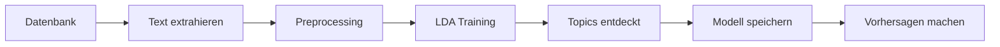

# Gruppe P1-3 — Projekt

## 📋 Requirements / Dependencies

Um das Projekt lokal laufen zu lassen, benötigst du:

* **Python** >= 3.13
* **Node.js** v20
* **uv** → https://docs.astral.sh/uv/
* IDE deiner Wahl, bevorzugt **VSCode**

## 🚀 Einrichtung

### Backend (FastAPI)

Wenn `uv` installiert ist, öffne das Terminal und führe folgendes aus:

```bash
cd backend
uv sync
```

Anschließend wählst du den `.venv`-Ordner als Python Interpreter für das Projekt aus.

**Alternative ohne uv:** Falls du klassisches `pip` verwenden möchtest:

```bash
cd backend
python -m venv .venv
source .venv/bin/activate  # Auf macOS/Linux
# .venv\Scripts\activate  # Auf Windows
pip install -r requirements.txt
```

Der Backend-Server kann wie folgt gestartet werden:

```bash
uv run uvicorn main:app --reload
```

oder mit klassischem Python:

```bash
python -m uvicorn main:app --reload
```

**Backend läuft unter:** `http://localhost:8000`  
**API-Dokumentation:** `http://localhost:8000/docs` (Swagger UI)

### Frontend (React + Vite)

Wenn `node` installiert ist, öffne das Terminal und führe folgendes aus:

```bash
cd frontend
npm install
```

Anschließend kannst du den Frontend-Dev-Server wie folgt starten:

```bash
npm run dev
```

**Frontend läuft unter:** `http://localhost:5173`

## 💡 Tipps

* Am besten hast du **2 Terminal-Sessions** offen, um Backend und Frontend gleichzeitig zu nutzen!
* Stelle sicher, dass die `.env`-Datei im Backend-Ordner korrekt konfiguriert ist
* Für Production-Build des Frontends: `npm run build`

## 📁 Projektstruktur

```
gruppe-P1-3/
├── backend/              # FastAPI Backend
│   ├── main.py          # Haupteinstiegspunkt
│   ├── config.py        # Konfiguration
│   ├── database/        # Datenbankverbindungen (Supabase)
│   ├── migrations/      # SQL-Migrationen
│   └── requirements.txt # Python Dependencies
├── frontend/            # React/Vite Frontend
│   ├── src/            # Quellcode
│   ├── public/         # Statische Assets
│   └── package.json    # Node.js Dependencies
└── requirements.txt     # Python Dependencies (Projekt-Root)
```

## 🛠️ Technologie-Stack

* **Backend:** FastAPI, Uvicorn, Supabase, Python-dotenv, Gensim (LDA Topic Modeling)
* **Frontend:** React 19, Vite, ESLint
* **Datenbank:** Supabase (PostgreSQL)

## 🤖 LDA Topic Modeling

Dieses Projekt enthält eine vollständige **LDA Topic Modeling**-Integration mit **Gensim** zur automatischen Themenextraktion aus Kandidaten- und Mitarbeiter-Feedback.

### Features

✅ **Automatische Topic-Erkennung** in Textdaten  
✅ **Datenbankintegration** - Direkter Zugriff auf Kandidaten- und Mitarbeiter-Daten  
✅ **RESTful API** - 8 Endpunkte für Training, Analyse und Vorhersage  
✅ **Modellpersistenz** - Speichern und Laden trainierter Modelle  
✅ **Deutsche Textverarbeitung** - Optimierte Stopword-Liste  
✅ **Flexible Analyse** - Einzelne Texte oder ganze Datensätze  

### Schnellstart

1. **Backend starten:**
   ```bash
   cd backend
   uv run uvicorn main:app --reload
   ```

2. **API-Dokumentation öffnen:**
   ```
   http://localhost:8000/docs
   ```

3. **Erstes Modell trainieren:**
   ```bash
   curl -X POST http://localhost:8000/api/topics/train \
     -H "Content-Type: application/json" \
     -d '{"source": "both", "num_topics": 5}'
   ```

### API-Endpunkte

| Endpoint | Methode | Beschreibung |
|----------|---------|--------------|
| `/api/topics/status` | GET | Model-Status abrufen |
| `/api/topics/database/stats` | GET | Datenbank-Statistiken |
| `/api/topics/train` | POST | Neues Modell trainieren |
| `/api/topics/topics` | GET | Entdeckte Topics anzeigen |
| `/api/topics/predict` | POST | Topics für Text vorhersagen |
| `/api/topics/analyze-record` | POST | Spezifischen Datensatz analysieren |
| `/api/topics/models/list` | GET | Gespeicherte Modelle auflisten |
| `/api/topics/models/load` | POST | Gespeichertes Modell laden |

### Installation testen

```bash
cd backend
uv run python test_topic_modeling.py
```

### Beispiele ausführen

```bash
cd backend
uv run python examples/topic_modeling_examples.py
```

### Dokumentation

- 📖 **Schnellstart**: [`backend/QUICKSTART_TOPIC_MODELING.md`](backend/QUICKSTART_TOPIC_MODELING.md)
- 📚 **API-Referenz**: [`backend/docs/TOPIC_MODELING_API.md`](backend/docs/TOPIC_MODELING_API.md)
- 🎯 **Feature-Guide**: [`backend/TOPIC_MODELING_README.md`](backend/TOPIC_MODELING_README.md)
- 💡 **Beispiele**: [`backend/examples/topic_modeling_examples.py`](backend/examples/topic_modeling_examples.py)

### Projektstruktur (Topic Modeling)

```
backend/
├── models/
│   └── lda_topic_model.py          # LDA-Modell-Implementierung
├── services/
│   └── topic_model_service.py      # Datenbankservice
├── routes/
│   └── topics.py                   # API-Endpunkte
├── examples/
│   └── topic_modeling_examples.py  # Verwendungsbeispiele
├── docs/
│   └── TOPIC_MODELING_API.md       # Vollständige API-Doku
├── test_topic_modeling.py          # Installationstest
├── TOPIC_MODELING_README.md        # Feature-Dokumentation
└── QUICKSTART_TOPIC_MODELING.md    # Schnellstart-Anleitung
```

### Workflow



### Datenquellen

**Candidates-Tabelle:**
- `stellenbeschreibung`
- `verbesserungsvorschlaege`

**Employee-Tabelle:**
- `jobbeschreibung`
- `gut_am_arbeitgeber_finde_ich`
- `schlecht_am_arbeitgeber_finde_ich`
- `verbesserungsvorschlaege`

### Beispiel-Verwendung

#### Python:
```python
import requests

# Modell trainieren
response = requests.post(
    "http://localhost:8000/api/topics/train",
    json={"source": "both", "num_topics": 5}
)
print(response.json())

# Text analysieren
response = requests.post(
    "http://localhost:8000/api/topics/predict",
    json={"text": "Die Arbeitsatmosphäre ist sehr gut."}
)
print(response.json()['topics'])
```

#### cURL:
```bash
# Topics abrufen
curl http://localhost:8000/api/topics/topics?num_words=10

# Datensatz analysieren
curl -X POST http://localhost:8000/api/topics/analyze-record \
  -H "Content-Type: application/json" \
  -d '{"record_id": 5, "source": "employee"}'
```

### Technische Details

- **LDA-Algorithmus**: Latent Dirichlet Allocation mit Gensim
- **Preprocessing**: Lowercase, Stopword-Entfernung, Token-Filterung
- **Sprache**: Optimiert für deutsche Texte
- **Parameter**: Konfigurierbare Topics (2-20), Passes, Iterations
- **Speicherung**: Automatisches Speichern trainierter Modelle
