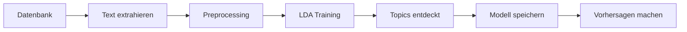

# Gruppe P1-3 — Projekt


## 📋 Inhaltsverzeichnis

- [Requirements / Dependencies](#-requirements--dependencies)
- [Schnellstart](#-schnellstart)
- [Installationsanleitung](#-installationsanleitung)
- [Einrichtung](#-einrichtung)
- [Projektstruktur](#-projektstruktur)
- [LDA Topic Modeling](#-lda-topic-modeling)
- [Technologie-Stack](#️-technologie-stack)

## ⚡ Schnellstart

```bash
# Backend starten
cd backend
uv sync
uv run uvicorn main:app --reload

# Frontend starten (neues Terminal)
cd frontend
npm install
npm run dev
```

**Backend:** `http://localhost:8000` | **API Docs:** `http://localhost:8000/docs`  
**Frontend:** `http://localhost:5173`

## 📋 Requirements / Dependencies

Um das Projekt lokal laufen zu lassen, benötigst du:

* **Python** >= 3.13
* **Node.js** v20+
* **npm** (kommt mit Node.js)
* **uv** → https://docs.astral.sh/uv/ (empfohlen für Python)
* **Supabase Account** (für Datenbank)
* IDE deiner Wahl, bevorzugt **VSCode**

### Python-Pakete (Backend):
* `fastapi` - Web Framework
* `gensim` - Topic Modeling (LDA)
* `transformers` >= 5.1 - ML-basierte Sentiment-Analyse (German BERT)
* `torch` >= 2.10 - PyTorch Backend für Transformers
* `pandas` - Datenverarbeitung
* `supabase` - Datenbank-Client
* `statsmodels` - Statistische Auswertung

### npm-Pakete (Frontend):
* `@radix-ui/react-checkbox` - Checkbox-Komponente
* `@radix-ui/react-label` - Label-Komponente
* `@radix-ui/react-dialog` - Dialog/Modal-Komponente
* `@radix-ui/react-select` - Select/Dropdown-Komponente
* `@radix-ui/react-dropdown-menu` - Dropdown-Menü-Komponente
* `@radix-ui/react-popover` - Popover-Komponente
* `@radix-ui/react-separator` - Separator-Komponente
* `cmdk` - Command-Menü-Komponente
* `recharts` - Chart-Bibliothek
* `lucide-react` - Icon-Bibliothek
* `tailwindcss` - CSS-Framework
* `html2canvas` + `jspdf` - PDF-Export

## � Installationsanleitung

Eine ausführliche Schritt-für-Schritt-Anleitung zur Einrichtung des Projekts findest du in der **[INSTALLATION.md](./INSTALLATION.md)**.

Sie enthält:
- Voraussetzungen & Software-Installation
- Backend- & Frontend-Setup (mit `uv` und `pip`)
- Umgebungsvariablen konfigurieren
- Installation verifizieren
- Häufige Probleme & Lösungen

## �🚀 Einrichtung

### Backend (FastAPI)

Wenn `uv` installiert ist, öffne das Terminal und führe folgendes aus:

```bash
cd backend
uv sync
```

Anschließend wählst du den `.venv`-Ordner als Python Interpreter für das Projekt aus.

**Alternative ohne uv:** Falls du klassisches `pip` verwenden möchtest:

```bash
cd backend
python -m venv .venv
source .venv/bin/activate  # Auf macOS/Linux
# .venv\Scripts\activate  # Auf Windows
pip install -r requirements.txt
```

Der Backend-Server kann wie folgt gestartet werden:

```bash
uv run uvicorn main:app --reload
```

oder mit klassischem Python:

```bash
python -m uvicorn main:app --reload
```

**Backend läuft unter:** `http://localhost:8000`  
**API-Dokumentation:** `http://localhost:8000/docs` (Swagger UI)

### Frontend (React + Vite)

Wenn `node` installiert ist, öffne das Terminal und führe folgendes aus:

```bash
cd frontend
npm install
```

Anschließend kannst du den Frontend-Dev-Server wie folgt starten:

```bash
npm run dev
```

**Frontend läuft unter:** `http://localhost:5173`

## � Umgebungsvariablen

Erstelle eine `.env`-Datei im `backend/` Ordner:

```env
# Supabase Configuration
SUPABASE_URL=deine-supabase-url
SUPABASE_KEY=dein-supabase-key

# Optional: API Configuration
API_HOST=0.0.0.0
API_PORT=8000
```

**Wichtig:** Die `.env`-Datei ist in `.gitignore` und wird nicht ins Repository committed!

## 💡 Tipps

* Am besten hast du **2 Terminal-Sessions** offen, um Backend und Frontend gleichzeitig zu nutzen!
* Stelle sicher, dass die `.env`-Datei im Backend-Ordner korrekt konfiguriert ist
* Für Production-Build des Frontends: `npm run build`
* Cache löschen: `find . -type d -name "__pycache__" -exec rm -rf {} +`
* Alte Modelle löschen: `cd backend/models && rm -f lda_model_*.* 2>/dev/null`

### Performance-Tipps (Version 2.1):
* **Dashboard lädt langsam?** → Hard-Reload (Cmd+Shift+R / Ctrl+Shift+F5)
* **API-Calls prüfen**: Browser DevTools → Network Tab → Filter "Fetch/XHR"
* **Re-Renders analysieren**: React DevTools → Profiler Tab
* **Caching aktiviert**: CompanySearchSelect cached automatisch nach erstem Load

### Topic Detail Modal Features:
* **Einklappbare Ansicht-Steuerung:** Klicke auf "Ansicht anpassen", um Elemente ein-/auszublenden
* **Intelligentes Layout:** Charts werden automatisch größer, wenn andere ausgeblendet werden
* **5 anpassbare Bereiche:**
  - ✅ Statistiken (Frequency, Rating, Sentiment)
  - ✅ Zeitverlauf-Chart (Rating über Zeit)
  - ✅ Sentiment-Chart (Gauge mit Prozentanzeige)
  - ✅ Typische Aussagen (Top 3 Statements)
  - ✅ Beispiel-Review (mit Navigation)
* **Zeit-Filter:** Wähle zwischen Gesamt, 1 Jahr, 6 Monate, 3 Monate oder 1 Monat
* **Review-Navigation:** Klicke auf Aussagen, um die vollständige Review zu sehen

## 📁 Projektstruktur

```
gruppe-P1-3/
├── backend/                      # FastAPI Backend
│   ├── main.py                  # Haupteinstiegspunkt
│   ├── config.py                # Konfiguration
│   ├── pyproject.toml           # Python Dependencies (uv)
│   ├── examples_statistical_usage.py # Statistik-Beispiele
│   │
│   ├── database/                # Datenbankverbindungen (Supabase)
│   │   └── supabase_client.py
│   │
│   ├── migrations/              # SQL-Migrationen
│   │   ├── 001_create_candidates_table.sql
│   │   ├── 002_create_employee_table.sql
│   │   ├── 003_create_companies_table.sql
│   │   └── 004_add_company_references.sql
│   │
│   ├── models/                  # Machine Learning Modelle
│   │   ├── lda_topic_model.py  # LDA Topic Modeling
│   │   ├── sentiment_analyzer.py # Sentiment-Analyse
│   │   └── saved_models/       # Trainierte Modelle
│   │
│   ├── services/                # Business Logic Services
│   │   ├── excel_service.py               # Excel Import/Export
│   │   ├── topic_model_service.py         # Topic Modeling DB Service
│   │   ├── topic_rating_service.py        # Topic-Rating-Analyse
│   │   ├── topic_average_rating_service.py # Topic-Durchschnittsbewertungen
│   │   ├── statistical_enrichment.py      # Statistische Anreicherung
│   │   └── statistical_validator.py       # Statistische Validierung
│   │
│   ├── routes/                  # API Endpoints
│   │   ├── analytics.py        # Analytics API (12 Endpoints)
│   │   ├── companies.py        # Company Management (9 Endpoints)
│   │   ├── topics.py           # Topic Modeling API (13 Endpoints)
│   │   └── upload.py           # File Upload
│   │
│   ├── scripts/                 # Utility Scripts
│   │   ├── train_models.py     # Model Training
│   │   ├── fix_html_entities.py # Text Cleanup
│   │   ├── sweep_num_topics_db.py    # Topic-Anzahl Optimierung
│   │   └── test_num_topics_compare.py # Topic-Vergleichstests
│   │
│   ├── tests/                   # Organisierte Tests
│   │   ├── topic_modeling/     # Topic Modeling Tests
│   │   ├── sentiment_analysis/ # Sentiment Tests
│   │   └── statistical/        # Statistical Tests
│   │
│   └── examples/                # Beispiele & Demos
│       ├── topic_modeling_examples.py
│       └── topic_rating_examples.py
│
├── frontend/                    # React/Vite Frontend
│   ├── src/                    # Quellcode
│   │   ├── components/         # React Komponenten
│   │   │   ├── CompanySearchSelect.jsx  # Optimiert mit Caching
│   │   │   ├── dashboard/     # Dashboard Components
│   │   │   │   ├── DominantTopicsCard.jsx   # Dominante Topics
│   │   │   │   ├── IndividualReviewsCard.jsx # Einzelne Reviews
│   │   │   │   ├── TimelineCard.jsx         # React.memo optimiert
│   │   │   │   ├── TopicRatingCard.jsx      # React.memo optimiert
│   │   │   │   ├── TopicOverviewCard.jsx    # React.memo optimiert
│   │   │   │   └── modals/
│   │   │   │       ├── MostCriticalModal.jsx
│   │   │   │       ├── NegativTopicModal.jsx
│   │   │   │       ├── SorceModal.jsx
│   │   │   │       ├── TrendModal.jsx
│   │   │   │       ├── TopicTableModal.jsx    # Topic Tabelle
│   │   │   │       ├── TopicDetailModal.jsx   # Topic Details mit Ansicht-Anpassen
│   │   │   │       └── ReviewDetailModal.jsx  # Vollständige Review-Ansicht
│   │   │   └── ui/            # UI Components (shadcn)
│   │   │       ├── badge.tsx
│   │   │       ├── button.tsx
│   │   │       ├── card.tsx
│   │   │       ├── checkbox.jsx
│   │   │       ├── command.tsx
│   │   │       ├── dialog.tsx
│   │   │       ├── dropdown-menu.tsx
│   │   │       ├── input.tsx
│   │   │       ├── label.jsx
│   │   │       ├── popover.tsx
│   │   │       ├── select.tsx
│   │   │       ├── separator.tsx
│   │   │       └── table.tsx
│   │   ├── pages/             # Seiten
│   │   │   ├── Dashboard.jsx
│   │   │   ├── Compare.jsx
│   │   │   └── Welcome.jsx
│   │   ├── utils/             # Hilfsfunktionen
│   │   │   ├── pdfExport.js   # PDF Export
│   │   │   ├── chartValidator.js # Chart Validierung
│   │   │   └── pdf/           # PDF Utilities
│   │   └── lib/               # Utilities
│   │       └── utils.ts
│   ├── public/                # Statische Assets
│   └── package.json           # Node.js Dependencies
├── requirements.txt            # Python Dependencies (Projekt-Root)
└── INSTALLATION.md             # Ausführliche Installationsanleitung
```

## 🛠️ Technologie-Stack

### Backend
* **Framework:** FastAPI (moderne Python Web API)
* **Server:** Uvicorn (ASGI Server)
* **Datenbank:** Supabase (PostgreSQL)
* **ML/AI:** 
  - Gensim 4.3+ (LDA Topic Modeling)
  - Transformers 5.1+ (ML-basierte Sentiment-Analyse mit German BERT)
  - PyTorch 2.10+ (Backend für Transformer-Modelle)
  - Lexikon-basierte Sentiment-Analyse (regelbasiert, schnell)
* **Statistik:** Statsmodels 0.14+
* **Datenverarbeitung:** Pandas, OpenPyXL
* **Tools:** Python-dotenv, Python-multipart

### Frontend
* **Framework:** React 19
* **Build Tool:** Vite 6
* **Routing:** React Router DOM 7
* **UI Library:** shadcn/ui (Radix UI + Tailwind CSS)
  - Dialog, Select, Dropdown Menu, Popover, Separator
  - Checkbox, Label (für Ansicht-Anpassung)
  - Badge, Button, Card, Input, Command, Table
* **Charts:** Recharts (Line Charts, Gauge Charts)
* **Icons:** Lucide React (Eye, ChevronDown, ChevronUp, Calendar, etc.)
* **PDF Export:** html2canvas + jsPDF
* **Styling:** Tailwind CSS v4 mit Custom Animations
* **Linting:** ESLint

### Dashboard Features
* **Performance-Optimierungen (Version 2.1):**
  - ⚡ **Paralleles Laden**: Alle KPI-Daten laden gleichzeitig (~50% schneller)
  - 💾 **Caching**: Firmenliste wird gecacht (~80% schneller ab 2. Öffnung)
  - ⏱️ **Debouncing**: Intelligente Suche mit 300ms Verzögerung
  - 🎯 **React.memo**: Optimierte Re-Renders für große Komponenten
  - 🔄 **Bessere Error Handling**: Explizites Logging für einfacheres Debugging

* **Topic Übersicht:**
  - Interaktive Topic-Tabelle mit Suchfunktion
  - Detailansicht mit Line Chart (Rating über Zeit)
  - Gauge Chart für Sentiment-Visualisierung
  - Typische Aussagen und Beispiel-Reviews
  - Zweistufige Modal-Interaktion (Tabelle → Details)
  - **Ansicht anpassen:** Ein-/ausblendbare Elemente mit intelligenter Layout-Anpassung
  - **Responsive Charts:** Charts passen sich automatisch an und werden größer, wenn andere ausgeblendet werden

### Datenbank Schema
* **Tables:** `candidates`, `employee`, `companies`
* **Features:** Star ratings, text feedback, relational data

## 🤖 LDA Topic Modeling

Dieses Projekt enthält eine vollständige **LDA Topic Modeling**-Integration mit **Gensim** zur automatischen Themenextraktion aus Kandidaten- und Mitarbeiter-Feedback.

### Features

✅ **Automatische Topic-Erkennung** in Textdaten  
✅ **Sentiment-Analyse** - Dual-Mode (Lexicon + ML-Transformer)
  - **Lexicon-Mode:** Schnell, regelbasiert, keine Dependencies
  - **Transformer-Mode:** ML-basiert mit German BERT, 100% Genauigkeit
✅ **Sterne-Bewertungen** - Kombiniert Text-Topics mit Rating-Daten  
✅ **Datenbankintegration** - Direkter Zugriff auf Kandidaten- und Mitarbeiter-Daten  
✅ **RESTful API** - 13 Endpunkte für Training, Analyse und Vorhersage  
✅ **Modellpersistenz** - Speichern und Laden trainierter Modelle  
✅ **Deutsche Textverarbeitung** - Optimierte Stopword-Liste  
✅ **Flexible Analyse** - Einzelne Texte oder ganze Datensätze  
✅ **Topic-Rating-Korrelation** - Verstehe welche Themen wie bewertet werden  

### Schnellstart

1. **Backend starten:**
   ```bash
   cd backend
   uv run uvicorn main:app --reload
   ```

2. **API-Dokumentation öffnen:**
   ```
   http://localhost:8000/docs
   ```

3. **Erstes Modell trainieren:**
   ```bash
   curl -X POST http://localhost:8000/api/topics/train \
     -H "Content-Type: application/json" \
     -d '{"source": "both", "num_topics": 5}'
   ```

### API-Endpunkte

| Endpoint | Methode | Beschreibung |
|----------|---------|--------------|
| `/api/topics/status` | GET | Model-Status abrufen |
| `/api/topics/database/stats` | GET | Datenbank-Statistiken |
| `/api/topics/train` | POST | Neues Modell trainieren |
| `/api/topics/topics` | GET | Entdeckte Topics anzeigen |
| `/api/topics/predict` | POST | Topics für Text vorhersagen |
| `/api/topics/analyze-record` | POST | Spezifischen Datensatz analysieren |
| `/api/topics/analyze/employee-reviews-with-ratings` | GET | Employee Reviews mit Topics, Sentiment & Ratings |
| `/api/topics/analyze/candidate-reviews-with-ratings` | GET | Candidate Reviews mit Topics, Sentiment & Ratings |
| `/api/topics/analyze/topic-rating-correlation` | GET | Korrelation zwischen Topics und Bewertungen |
| `/api/topics/models/list` | GET | Gespeicherte Modelle auflisten |
| `/api/topics/models/load` | POST | Gespeichertes Modell laden |
| `/api/topics/company/{company_id}/negative-topics` | GET | Negative Topics einer Firma |
| `/api/topics/company/{company_id}/most-critical` | GET | Kritischste Topics einer Firma |

### Installation testen

```bash
# Tests ausführen
cd backend
pytest tests/
```

### Beispiele ausführen

**Basic Topic Modeling:**
```bash
cd backend
uv run python examples/topic_modeling_examples.py
```

**Topic-Rating-Analyse (NEU):**
```bash
cd backend
uv run python examples/topic_rating_examples.py
```

### Beispiele

- 💡 [`backend/examples/`](backend/examples/) - Beispiele & Demos
  - `topic_modeling_examples.py` - Basic LDA
  - `topic_rating_examples.py` - Topics + Sentiment + Ratings

### Workflow



### Datenquellen

**Candidates-Tabelle:**
- `stellenbeschreibung`
- `verbesserungsvorschlaege`

**Employee-Tabelle:**
- `jobbeschreibung`
- `gut_am_arbeitgeber_finde_ich`
- `schlecht_am_arbeitgeber_finde_ich`
- `verbesserungsvorschlaege`

### Beispiel-Verwendung

#### Python (Topic-Rating-Analyse):
```python
import requests

# Modell trainieren
response = requests.post(
    "http://localhost:8000/api/topics/train",
    json={"source": "employee", "num_topics": 5}
)
print(response.json())

# Employee Reviews mit Sentiment & Ratings analysieren
response = requests.get(
    "http://localhost:8000/api/topics/analyze/employee-reviews-with-ratings",
    params={"limit": 50}
)
analysis = response.json()['analysis']

# Topic-Rating-Korrelation abrufen
response = requests.get(
    "http://localhost:8000/api/topics/analyze/topic-rating-correlation"
)
correlation = response.json()['correlation']

for topic in correlation['topics']:
    print(f"Topic {topic['topic_id']}: "
          f"{topic['avg_rating']:.1f}⭐ "
          f"({topic['mention_count']} Erwähnungen)")
```

#### cURL:
```bash
# Topics mit Ratings analysieren
curl "http://localhost:8000/api/topics/analyze/topic-rating-correlation"

# Text analysieren
curl -X POST http://localhost:8000/api/topics/predict \
  -H "Content-Type: application/json" \
  -d '{"text": "Die Work-Life-Balance ist ausgezeichnet!", "threshold": 0.1}'
```

### Technische Details

- **LDA-Algorithmus**: Latent Dirichlet Allocation mit Gensim
- **Sentiment-Analyse**: Lexikon-basiert mit 100+ deutschen Sentiment-Wörtern
  - Erkennt Intensifizierer (sehr, extrem, total)
  - Berücksichtigt Negationen (nicht, kein, nie)
  - Berechnet Polarity (-1 bis +1) und Subjectivity (0 bis 1)
- **Preprocessing**: Lowercase, Stopword-Entfernung, Token-Filterung
- **Sprache**: Optimiert für deutsche Texte
- **Parameter**: Konfigurierbare Topics (2-20), Passes, Iterations
- **Speicherung**: Automatisches Speichern trainierter Modelle
- **Integration**: Kombiniert Topics, Sentiment und Sterne-Bewertungen

## 🚨 Häufige Probleme & Lösungen

### Backend startet nicht
```bash
# Port 8000 ist belegt
lsof -ti:8000 | xargs kill -9
uv run uvicorn main:app --reload
```

### Frontend startet nicht
```bash
# Dependencies fehlen
cd frontend
npm install
npm run dev

# Spezifische Pakete nachinstallieren (falls notwendig)
npm install @radix-ui/react-checkbox @radix-ui/react-label
```

### Dashboard lädt langsam (Version 2.1 sollte das beheben!)
```bash
# 1. Hard-Reload im Browser
# Chrome/Edge: Cmd+Shift+R (Mac) oder Ctrl+Shift+F5 (Windows)
# Firefox: Cmd+Shift+R (Mac) oder Ctrl+F5 (Windows)

# 2. Browser Cache löschen
# DevTools → Application → Clear Storage

# 3. Prüfe Network Tab
# DevTools → Network → Prüfe ob KPI-Calls parallel laufen
# Sollten jetzt ~50% schneller sein!
```

### "Model not trained" Error
```bash
# Trainiere zuerst ein Modell
curl -X POST http://localhost:8000/api/topics/train \
  -H "Content-Type: application/json" \
  -d '{"source": "employee", "num_topics": 5}'
```

### Python Cache Probleme
```bash
# Lösche alle __pycache__ Verzeichnisse
find . -type d -name "__pycache__" -exec rm -rf {} +
```

### Alte Modelle löschen
```bash
# Speicherplatz freigeben
cd backend/models
rm -f lda_model_*.* 2>/dev/null
```

### Tests finden nach Reorganisation
```bash
# Tests sind jetzt organisiert in backend/tests/
pytest backend/tests/                    # Alle Tests
pytest backend/tests/topic_modeling/     # Nur Topic Modeling
pytest backend/tests/sentiment_analysis/ # Nur Sentiment
pytest backend/tests/statistical/        # Nur Statistical
```

## 📚 Weitere Ressourcen

### Projekt-Dokumentation
- **Installationsanleitung**: [INSTALLATION.md](./INSTALLATION.md)
- **Test-Dokumentation**: [backend/tests/](./backend/tests/)
- **Beispiele**: [backend/examples/](./backend/examples/)

### API & Tools
- **API Dokumentation**: http://localhost:8000/docs (Swagger UI)
- **Supabase**: https://supabase.com/docs
- **FastAPI**: https://fastapi.tiangolo.com
- **React**: https://react.dev
- **Gensim**: https://radimrehurek.com/gensim/
- **Recharts**: https://recharts.org/

## 👥 Team

Gruppe P1-3 - Bachelor Projekt

## 📄 Lizenz

Dieses Projekt ist für Bildungszwecke erstellt.
