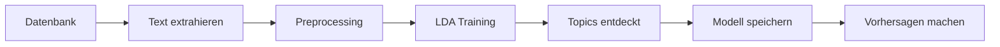

# 📊 LDA Topic Modeling Integration

## Übersicht

Dieses Projekt integriert **LDA (Latent Dirichlet Allocation) Topic Modeling** mit **Gensim**, um automatisch Themen in Kandidaten- und Mitarbeiter-Feedback zu entdecken. Die Lösung ist vollständig in das FastAPI-Backend integriert und nutzt die Supabase-Datenbank.

## 🎯 Features

- **Automatische Topic-Erkennung** in Textdaten
- **Datenbankintegration** - Direkter Zugriff auf Kandidaten- und Mitarbeiter-Daten
- **RESTful API** - Einfache Integration über HTTP-Endpunkte
- **Modellpersistenz** - Speichern und Laden trainierter Modelle
- **Flexible Analyse** - Analyse einzelner Texte oder ganzer Datensätze
- **Deutsche Stopwords** - Optimiert für deutsche Texte

## 📁 Projektstruktur

```
backend/
├── models/
│   └── lda_topic_model.py      # LDA-Modell-Implementierung
├── services/
│   └── topic_model_service.py  # Datenbankservice
├── routes/
│   └── topics.py               # API-Endpunkte
├── examples/
│   └── topic_modeling_examples.py  # Beispiele
├── docs/
│   └── TOPIC_MODELING_API.md   # Vollständige API-Doku
└── models/                      # Gespeicherte Modelle (wird erstellt)
```

## 🚀 Quick Start

### 1. Installation

```bash
cd backend
uv sync
```

Oder mit pip:

```bash
pip install gensim>=4.3.0
```

### 2. Backend starten

```bash
cd backend
uv run uvicorn main:app --reload
```

### 3. API aufrufen

**Swagger UI öffnen:**
```
http://localhost:8000/docs
```

**Erstes Modell trainieren:**
```bash
curl -X POST http://localhost:8000/api/topics/train \
  -H "Content-Type: application/json" \
  -d '{"source": "both", "num_topics": 5}'
```

## 📖 Wichtige API-Endpunkte

| Endpoint | Methode | Beschreibung |
|----------|---------|--------------|
| `/api/topics/status` | GET | Model-Status abrufen |
| `/api/topics/train` | POST | Neues Modell trainieren |
| `/api/topics/topics` | GET | Entdeckte Topics anzeigen |
| `/api/topics/predict` | POST | Topics für Text vorhersagen |
| `/api/topics/analyze-record` | POST | Datensatz analysieren |

Vollständige Dokumentation: [TOPIC_MODELING_API.md](docs/TOPIC_MODELING_API.md)

## 💡 Verwendungsbeispiele

### Beispiel 1: Modell trainieren

```python
import requests

response = requests.post(
    "http://localhost:8000/api/topics/train",
    json={
        "source": "both",
        "num_topics": 5,
        "limit": 100
    }
)
result = response.json()
print(f"Trainiert auf {result['data']['num_documents']} Dokumenten")
```

### Beispiel 2: Text analysieren

```python
response = requests.post(
    "http://localhost:8000/api/topics/predict",
    json={
        "text": "Die Arbeitsatmosphäre ist sehr gut und das Team ist super.",
        "threshold": 0.1
    }
)
topics = response.json()['topics']
for topic in topics:
    print(f"Topic {topic['topic_id']}: {topic['probability']:.2%}")
```

### Beispiel 3: Datensatz analysieren

```python
response = requests.post(
    "http://localhost:8000/api/topics/analyze-record",
    json={
        "record_id": 5,
        "source": "employee"
    }
)
result = response.json()
print(f"Gefundene Topics: {result['topics']}")
```

## 🔧 Konfiguration

### LDA-Parameter

Die wichtigsten Parameter können beim Training konfiguriert werden:

```python
{
    "num_topics": 5,      # Anzahl Topics (2-20)
    "passes": 15,         # Durchläufe durch Korpus
    "iterations": 400     # Iterationen pro Durchlauf
}
```

### Datenquellen

**Candidates-Tabelle:**
- `stellenbeschreibung`
- `verbesserungsvorschlaege`

**Employee-Tabelle:**
- `jobbeschreibung`
- `gut_am_arbeitgeber_finde_ich`
- `schlecht_am_arbeitgeber_finde_ich`
- `verbesserungsvorschlaege`

## 📊 Workflow



1. **Daten sammeln** - Texte aus Datenbank laden
2. **Preprocessing** - Bereinigung und Tokenisierung
3. **Training** - LDA-Modell trainieren
4. **Analyse** - Topics entdecken und interpretieren
5. **Anwendung** - Neue Texte analysieren

## 🧪 Tests und Beispiele

Führe das Beispiel-Script aus:

```bash
cd backend
uv run python examples/topic_modeling_examples.py
```

Das Script demonstriert:
- ✅ Basis-Training
- ✅ Topic-Vorhersage
- ✅ Datenbankintegration
- ✅ Modell speichern/laden

## 🔍 Topic-Interpretation

Nach dem Training erhältst du Topics wie:

**Topic 0: Teamarbeit**
- team (0.045)
- zusammenarbeit (0.038)
- kollegial (0.032)

**Topic 1: Gehalt**
- gehalt (0.052)
- bezahlung (0.041)
- sozialleistungen (0.035)

**Topic 2: Work-Life-Balance**
- work-life-balance (0.048)
- flexibel (0.039)
- homeoffice (0.033)

## 🛠️ Entwicklung

### Neue Features hinzufügen

1. **Erweitere das Modell** in `models/lda_topic_model.py`
2. **Füge Service-Methoden hinzu** in `services/topic_model_service.py`
3. **Erstelle neue Endpoints** in `routes/topics.py`

### Eigene Stopwords hinzufügen

Erweitere die `german_stopwords` Liste in `lda_topic_model.py`:

```python
self.german_stopwords = set([
    'der', 'die', 'das',
    # Deine eigenen Stopwords hier
])
```

## 📈 Best Practices

1. **Datenqualität** - Mind. 20-30 Dokumente für aussagekräftige Ergebnisse
2. **Topic-Anzahl** - Starte mit 5, passe basierend auf Ergebnissen an
3. **Re-Training** - Trainiere neu bei signifikanten Datenänderungen
4. **Threshold** - Verwende 0.1-0.15 für Topic-Vorhersagen
5. **Modelle speichern** - Sichere trainierte Modelle regelmäßig

## 🚨 Troubleshooting

### "No model trained yet"
→ Trainiere zuerst ein Modell mit `/api/topics/train`

### "No text data found"
→ Stelle sicher, dass Daten in der Datenbank vorhanden sind

### Import-Fehler: gensim
→ Installiere: `uv add gensim` oder `pip install gensim`

### Schlechte Topic-Qualität
→ Erhöhe die Anzahl der Trainingsdokumente
→ Passe `num_topics` Parameter an
→ Füge domänenspezifische Stopwords hinzu

## 📚 Ressourcen

- [Gensim Dokumentation](https://radimrehurek.com/gensim/)
- [LDA Paper](https://www.jmlr.org/papers/volume3/blei03a/blei03a.pdf)
- [Topic Modeling Tutorial](https://www.machinelearningplus.com/nlp/topic-modeling-gensim-python/)

## 🤝 Beitragen

Ideen für Erweiterungen:
- [ ] Visualisierung mit pyLDAvis
- [ ] Erweiterte deutsche NLP (spaCy)
- [ ] Batch-Verarbeitung aller Datensätze
- [ ] Topic-Trends über Zeit
- [ ] Export-Funktionen (CSV, JSON)
- [ ] Frontend-Integration

## 📝 Lizenz

Teil des Bachelor-Projekts Gruppe P1-3
